# Logic Gates 

## Introduction

Logic gates are the fundamental building blocks in digital electronics.

Logic gates  perform logical operation based on the inputs provided to it and gives a logical output that can be either high(1) or low(0).

Logic gates are used in our day-to-day lives,such as in the architecture of our telephones,laptops,tablets and memory devices.

# Types of Logic Gates
 There are basically seven main types of logic gates.

## 1. AND GATE

### Definition
The output state of the AND gate will be high(1) if both the input is high(1).

### Boolean Expression

Y = A . B
The value of y will be True when both the inputs will be True.

### Truth Table

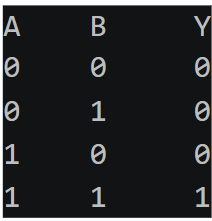

### Diagram

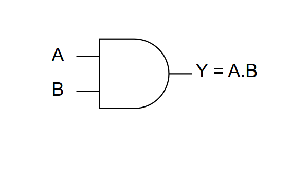

### Real Life Example
An AND gate works like a circuit where two switches must be ON to light a bulb.

## 2. OR GATE 

### Definition 
The output state of OR gate will be high(1) if any of the input state is high(1).

### Boolean Expression

Y = A + B
The value of y will be True when one of the inputs will be True.

### Truth Table

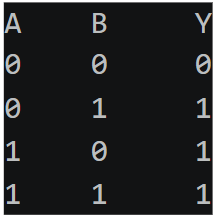

### Diagram
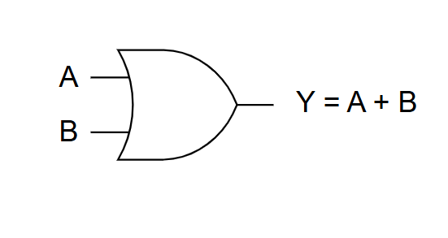

## 3. NOT GATE 

### Definition 
When the input signal is low(0) the output signal is high(1) and vice-versa.

### Boolean Expression

Y = A' 
The value of y will be HIGH when A will be low.

### Truth Table

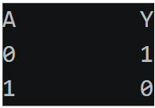

### Diagram

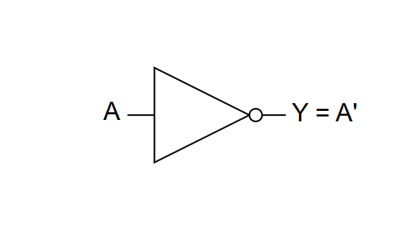

## 4. NOR GATE
It is the universal logic gate

### Definition
The output state of the NOR gate will be high(1) when all  the input are low(0).

### Boolean Expression

Y = (A + B)'
The value of y will be True when all the inputs are set to 0.

### Truth Table

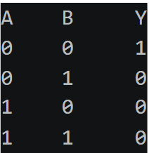

### Diagram

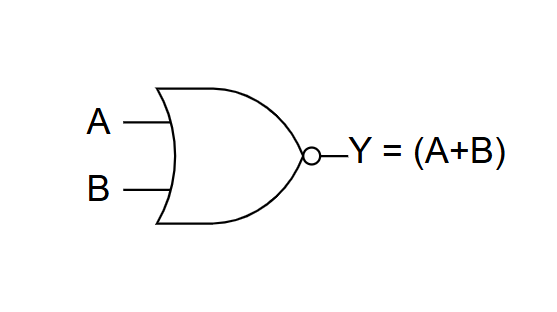

## 5. NAND GATE 

### Definition
The output state of the NAND gate will be high(1) when either of the input is high(1) or both of its inputs are low(0).

### Boolean Expression

Y = (A . B)'

### Truth Table

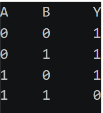

### Diagram

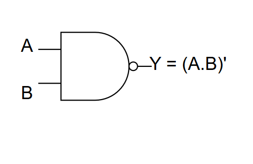

## 6. XOR GATE 

### Definition
The output state of the XOR gate will be high(1)  if one of them low(0) then the other one will be high(1).

### Boolean Expression

Y = A'B + AB'

### Truth Table

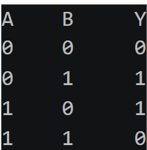

### Diagram

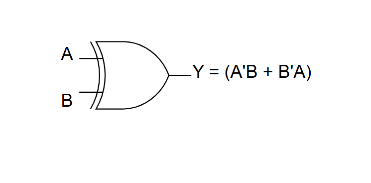

## 7. XNOR GATE 

### Definition
The output state of the XNOR gate will be high(1) when both the inputs are high(1) or low(0).

### Boolean Expression

Y = AB + A'B'

### Truth Table

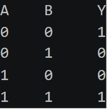

### Diagram

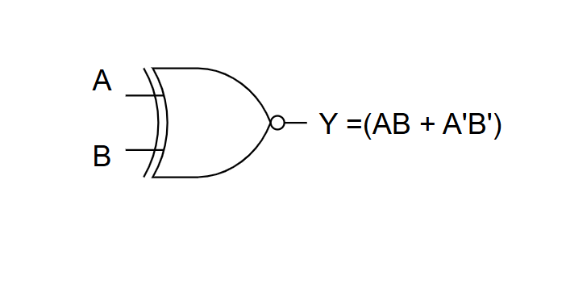

# Conclusion
Logic gates are essential components of digital electronics.Understanding these components help students to learn and explore advance topics like flip=flops , counter, register and processor.
